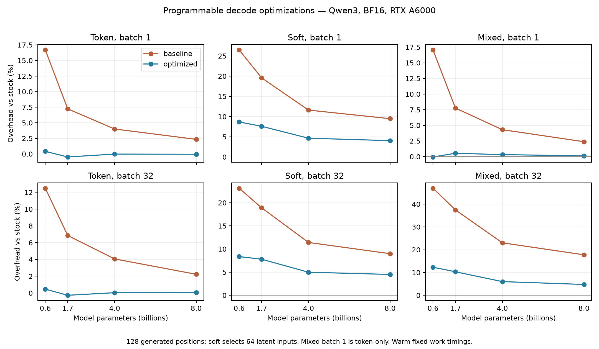

# Optimizing programmable latent decoding

This experiment implements and tests all six proposed optimization directions:
native token input with latent selection, dependency pruning and eligible LM-head
skipping, captured transition staging, inactive-work elimination, common work
sharing, and alternative dense or top-k expectation backends. The selected
default combines the first five with GPU-conditional **cuBLAS** execution.
Custom reduction kernels and top-k mixtures remain explicit experiments.

## Protocol and evidence

The final comparison uses Qwen3 0.6B, 1.7B, 4B, and 8B on RTX A6000 48 GB GPUs,
BF16, single-GPU synchronous vLLM V1, batches 1/8/32, and 128 generated positions.
Each engine/policy/batch has two warmups and nine measured generations. Stock
vLLM runs before and after each model's comparison; the stock reference pools
those 18 samples. The old fork is commit `d5a9fa9`, whose engine is unchanged
from `045a0a1`. Model revisions are pinned in
[models.json](../scaling/models.json). The container is pinned to
`vllm/vllm-openai@sha256:c1c9f6fd5c109ba7f0546a59f5b2f15fb87f64c77782e90a27b648b42a8e67c3`
(vLLM 0.31.0, PyTorch 2.13, CUDA 13).

Token requests always decode normally. Soft and hidden presets select 64 latent
inputs followed by token inputs. Entropy uses the existing illustrative
threshold-2 preset, not the complete SwiReasoning state machine. Mixed batches
cycle token/soft/hidden/entropy policies; mixed batch 1 is token-only. Request
lengths, prompts, sampling settings, and transition contracts match between the
old and optimized forks. Loading, compilation, first-use program capture, and
quality checks are outside the timing interval. These are warm end-to-end
fixed-work timings, not isolated inter-token latency or online serving SLOs.

The final files are `release-model0.jsonl`, `release-1.7B.jsonl`,
`release-model2.jsonl`, and `release-8B.jsonl`. There are 144 timing groups and
1,296 measured generations in that comparison. The [full table](TABLES.md),
[machine-readable summary](summary.csv), and [verification](verification.json)
are generated by [summarize_optimization.py](../../benchmarks/latent/summarize_optimization.py).
Bootstrap intervals describe repeat variability within these sessions; they do
not cover different prompts, GPUs, software versions, or independent days.



## Final performance

Batch 32, median latency for the mixed-policy workload:

| Model | Previous fork | Optimized fork | Latency reduction | Optimized overhead vs stock |
| --- | --- | --- | --- | --- |
| 0.6B | 0.9977 s | 0.7623 s | 23.6% | 12.3% |
| 1.7B | 1.5607 s | 1.2526 s | 19.7% | 10.3% |
| 4B | 2.6260 s | 2.2626 s | 13.8% | 6.0% |
| 8B | 4.3168 s | 3.8400 s | 11.0% | 4.8% |

At batch 1, dense-soft latency falls by 14.1%, 10.0%, 6.2%, and 5.0%
respectively. Its remaining overhead versus stock is 8.7%, 7.6%, 4.6%, and 4.0%.
At batch 32, dense-soft latency falls by 12.0%, 9.3%, 5.8%, and 4.1%.
Token-program overhead is between -0.5% and +0.8% across all twelve model/batch
combinations. Bracketing stock-control drift reaches 1.6%, so small negative
overheads are measurement variation, not evidence that the extension accelerates
the underlying transformer. The dense expectation's remaining cost is real;
the optimized interface is close to stock for token decoding but does not make
latent arithmetic free.

## What each change contributes

The 0.6B screening sweep isolates individual features and their combination
using 128 positions and five repetitions at batches 1 and 32. The 8B sweep uses
64 positions and five repetitions, including leave-one-out combinations.
These are development ablations, with exact source snapshots in
`screen-v1-sources.tar.gz` and `ablation-v2-sources.tar.gz`. They precede the
capture-stream fix described below; final headline results use the corrected
runtime. Effects are workload-specific and not additive.

| Change | Measured evidence | Decision |
| --- | --- | --- |
| Native input selection | Alone on 0.6B: token B1 0.5288 → 0.5017 s; mixed B32 0.9970 → 0.9683 s. Removing it from the 8B core adds about 0.7–1.0% in the tested policies. | Default; reads either the native token embedding or request-owned latent history inside the captured model. |
| Dependency pruning | Alone on 0.6B: token B32 0.7752 → 0.7545 s; soft B32 0.8304 → 0.8290 s. The 8B leave-one-out effects are small and mixed. | Default for avoiding unused inputs and enabling safe head skipping; no claim of a large standalone speedup. |
| Captured staging and commit | Alone on 0.6B: mixed B32 0.9970 → 0.9171 s, but soft B32 is slightly slower, 0.8304 → 0.8341 s. In the 8B core, its incremental timing effect is small. | Default as part of the combined path and shared execution; not uniformly beneficial in isolation. |
| Static inactive-phase skipping | Alone on 0.6B: mixed B32 0.9970 → 0.8358 s. Removing it from the 8B core raises soft B32 from 2.0105 to 2.0824 s and mixed B32 from 2.0689 to 2.2042 s. | Default; skip only stateless phases proven inactive from position metadata. |
| Shared common expressions | Core → shared, mixed B32: 0.7781 → 0.7622 s on 0.6B; 2.0689 → 2.0333 s on 8B. | Default when programs contain a common dense expectation. Distinct projections stay grouped. |
| Skip eligible LM head | On 8B, explicit zero-fallback hidden prefix: B1 1.5834 → 1.5256 s; B32 1.9331 → 1.8778 s. | Enabled, but applied only when every scheduled request is provably eligible. Standard token-fallback hidden programs retain the head. |
| Top-10 expectation | On 8B: top-10 B1 1.5865 s versus dense soft 1.6449 s; B32 1.9491 versus 2.0105 s. | Explicit `TOPK_EXPECT` opcode. It changes the algorithm and is not substituted for dense feedback. |

The 0.6B combined core reduces mixed B32 latency by 22.0%, more than native
input selection or captured staging alone. Conversely, the 8B leave-one-out
results do not justify claiming that every feature independently improves every
workload. Pruning is especially valuable for memory and eligibility analysis;
the model dominates execution time at larger sizes.

## Dense expectation: retain cuBLAS, conditionally avoid it

The [kernel sweep](expectation-conditional.json) covers vocabulary 151,936,
widths 1,024/2,048/2,560/4,096, batches 1/8/32, and active/inactive groups. Each
measurement uses 30 CUDA-graph replays. It measures transition arithmetic only,
excluding transformer and scheduler work.

A streaming softmax/expectation kernel was slower than cuBLAS for active groups,
especially at batch 32. A split-K tensor-core kernel was much closer but changed
floating-point reductions. At width 4,096 and batch 32, the latter was about
2.02 ms versus 1.99 ms for cuBLAS. Combining shared execution with that kernel
was worse than sharing alone in the 8B mixed workload: 2.0728 versus 2.0333 s.
These backends are available as `fused_expect` and `gated_expect`, outside the
default profile. Kernel error measurements are retained alongside their timings.

The tested PyTorch build exposes conditional CUDA graph nodes. The chosen path
performs a GPU `any` reduction over the latent mask and executes the original
cuBLAS multiplication only if the group has an active consumer. At width 4,096,
batch 32, active execution measured 2.01 ms versus 1.99 ms, while all-inactive
execution measured 0.17 ms. Active outputs matched cuBLAS exactly in the tested
cases. This skips an entire inactive group; it does not compact individual
active rows. Shared multi-policy graphs currently use one unconditional common
GEMM, because a per-policy gate cannot safely guard a result shared by other
consumers.

A standard-mode end-to-end ablation disables only `conditional_expect` at
0.6B and 8B, with nine repetitions and the same 128-position workloads. Enabling
it reduces entropy-workload latency by 2.8–5.9% on 0.6B and 3.7–3.8% on 8B.
Those prompts produce no latent selections at threshold 2; this is specifically
evidence about avoiding inactive work. Mixed-policy timings change by less than
1%, consistent with their shared unconditional GEMM. The control files are
`conditional-control-model0.jsonl` and `conditional-control-model3.jsonl`.
Those controls ran on another A6000 of the same node, so their small percentage
differences are estimates rather than a same-card paired causal measurement.
The isolated same-card kernel result supports the direction and approximate
magnitude: avoiding about 1.8 ms over 64 eligible 8B positions predicts roughly
0.12 s saved, close to the observed batch-1 end-to-end difference.

## Correctness, quality, and a failure found during testing

The CUDA unit suite covers program validation, pruning equivalence, state,
request reordering, chunked prefill, program eviction, staged history commit,
admission while state is live, input selection, conditional execution, and
top-k semantics. The integration runs exercise changing batch shapes, program
replacement, mixed policies, and model outputs.

An initial candidate passed the fixed-shape timing sweep but crashed during
subsequent short-prompt evaluations. The failure reproduced after repeated
transition graph capture/destruction and localized to replay of a model CUDA
graph. A persistent capture stream per transition runner eliminated that
reproducer. This is consistent with PyTorch's graph reset clearing cuBLAS
workspaces associated with its capture stream; see the
[PyTorch implementation](https://github.com/pytorch/pytorch/blob/main/aten/src/ATen/cuda/CUDAGraph.cpp)
and [CUDA workspace documentation](https://github.com/pytorch/docs/blob/site/stable/notes/cuda.md).
The experiments establish the failure and the successful fix, not a complete
upstream root-cause proof. The failed `final-*` and `debug-mixed*` logs are
retained. They are excluded from the final performance comparison. The corrected
`debug-stream` workload, conditional engine check, and final release suites
include both timing and subsequent short-prompt evaluations.

In the primary runs, 42 of 60 policy/model/batch comparisons have identical
complete final-repetition token traces. Eighteen groups show within-engine
repeat variation in at least one engine. Default-kernel execution therefore
does not promise bitwise reproducibility. All four optimized short token and
soft traces match the independent Transformers fixtures. Short hidden feedback
matches on 0.6B and 8B, but retains the previously documented 1.7B/4B divergence;
see the [earlier trajectory audit](../scaling/REPORT.md#correctness-and-numerical-reproducibility).

All twelve aggregate arithmetic scores (four models × three common policies)
match between the old and optimized engines. However, 8B has eight individual
correctness flips across its 192 comparisons, balanced between gains and losses.
Equal aggregate scores are not per-example equivalence. Top-10 scores are
52/55/47/55 out of 64, versus dense-soft 53/55/47/56 in model-size order.

The stricter batch-invariant diagnostic initially exposed a compatibility bug:
`torch.mm(..., out=...)` bypassed vLLM's invariant matmul dispatch and attempted
first-use cuBLAS initialization inside a conditional graph. The corrected
invariant path uses the dispatched matrix multiplication followed by an output
copy. Standard-mode cuBLAS execution is unchanged. The primary measured source
is retained in `release-measured-sources.tar.gz`; the final compatibility patch
and its diagnostics are separate from those timings.

The completed [invariant diagnostics](diagnostics.json) use batch 32, 128
positions, and three repetitions. All repetitions within each engine are stable.
Old/new traces match for all 32 requests in each tested 0.6B policy
(token/entropy/mixed), and in all five policies on 4B and 8B. On 1.7B, matches
are 25/32 for token, 25/32 for entropy, and 23/32 for mixed; the first token-only
divergence is at position 59. Thus invariant mode resolves many observed
differences but does not establish cross-implementation bitwise equivalence.
The remaining 1.7B divergence is not fully localized. No claim of universal
numerical or reasoning-quality equivalence is made.

For the explicit zero-fallback hidden policy, a separate final-source 8B
invariant comparison matches every trace at batches 1 and 32 across five
repetitions. Skipping the head saves 3.8% and 2.7%, respectively. The earlier
standard-kernel head ablation has differing traces, so its timings alone would
not suffice as a correctness check.

The default profile passes mixed-policy request turnover, unequal lifetimes,
chunked prefill, and forced KV-cache recomputation: all 12 invariant-mode traces
match with 32 versus 11,000 cache blocks. The constrained run has four
preemptions; the unconstrained run has none. This also exercises configuration
without an explicit optimization list. See [preemption verification](preemption-verification.json)
and [the reproduction script](../../benchmarks/latent/verify_optimized.sh).

The final CUDA suite reports **26 passed**, including replay of an older
individual graph after replacing shared graphs. A final standard-mode 0.6B
engine smoke run after the invariant compatibility fix completes six timing
groups, all four arithmetic policies, and all three short-reference checks.
Source hashes and the exact compatibility-only diff are in
[source-versions.json](source-versions.json) and
[invariant-compatibility.patch](invariant-compatibility.patch). The changed-file
pre-commit checks and full-tree Python 3.12 type check are included in validation.

The arithmetic check has 64 fixed addition, multiplication, multistep, and word
questions, a 64-position budget, and a four-position latent prefix. Its score
checks the last integer in the decoded answer; strict integer-only formatting
is reported separately. Raw responses and token sequences are retained. This
small synthetic set can catch gross regressions but cannot establish reasoning
quality parity, usefulness of raw hidden feedback, or preservation under top-k
approximation. The checkpoints were not trained for these latent policies.

## Scope, minimization, and remaining improvements

The improvement comes from reducing transition overhead while retaining paged
attention and request-owned embedding replay. Vocabulary-sized input buffers
are now allocated lazily and shared by staged programs. A token-only engine
does not stage full-vocabulary logits for transitions. However, per-shape CUDA
graph temporaries and conditional-node library workspaces still consume memory.
The kernel file reports active and peak incremental PyTorch allocation, not
total reserved VRAM or KV-cache capacity. Graph memory is still not completely
reserved before vLLM sizes its KV cache. This remains an admission-budget issue.

The default is a measured compromise, not a global optimum over all programs.
Remaining promising work includes a union-of-consumers gate for shared
expectations, active-row compaction when many rows are inactive, caching
compiled programs across admission turnover, pre-reserving graph workspace,
and moving more metadata preparation into persistent device buffers. A learned
low-rank projection can be expressed as two `PROJECT` operations, but evaluating
its accuracy needs a trained mapping; this experiment does not invent one.
Admission latency, online arrival loads, tensor parallelism, quantization, and
other model families need separate experiments.

For context, this table places the new dense-soft result beside the previously
measured specialized forks, at batch 1 and 128 generated positions:

| Model | Optimized dense soft (s) | Qwen top-10 (s) | Qwen SwiReasoning (s) | 1Cat SwiReasoning (s) |
| --- | --- | --- | --- | --- |
| 0.6B | 0.4946 | 0.5992 | 0.5093 | 1.9868 |
| 1.7B | 0.9585 | 1.0411 | 0.9546 | 2.4170 |
| 4B | 1.9123 | 1.9654 | 1.9061 | 3.1640 |
| 8B | 3.2749 | 3.2964 | 3.2294 | 4.4842 |

The specialized columns are reused from the [existing-fork comparison](../scaling/REPORT.md),
not rerun in this optimization sweep. They use different transition policies,
latent-position counts, arithmetic, and software versions, with their own
controls documented there. The optimized dense preset is now numerically close
in wall time to the Qwen SwiReasoning column, but these values cannot establish
equal-work speedup or equal-quality superiority over that method. The controlled
improvement established here is over our earlier runtime under matching
transition contracts. This fork still does not contain a complete SwiReasoning
adapter.

## Reproduce

Use the pinned container above and model snapshots, with one GPU per experiment.
The [GPU job template](../../benchmarks/latent/job.yaml) records resource requests.
The benchmark expects release-matched native libraries and these Python overlays:
`/tmp/latent-baseline` from commit `d5a9fa9`, `/tmp/latent-overlay` from this
checkout, and the installed package for stock. Overlay construction follows
[run_suite.sh](../../benchmarks/latent/run_suite.sh). Install pytest using
`uv` into a virtual environment with the container's system packages.

```bash
HF_HUB_OFFLINE=1 /tmp/latent/.venv/bin/python \
  benchmarks/latent/optimization_sweep.py --model-index 0 \
  --plan results/optimization/release-plan.json \
  --output results/optimization/release-model0.jsonl \
  --repeats 9 --batches 1,8,32
```

Repeat for model indices 1/2/3 and the corresponding release filenames. Use
fresh output files: the harness appends raw measurements. Screening and 8B
ablation plans are separate JSON files; the latter uses `--steps 64` and five
repetitions. Run the kernel harness on the same stack and regenerate tables with
`.venv/bin/python benchmarks/latent/summarize_optimization.py`. Every final
timing row includes source digest, model revision, raw durations, token traces,
and hashes. Also run
`.venv/bin/python benchmarks/latent/summarize_optimization_diagnostics.py` for
the separate invariant and preemption summary. All GPU jobs used for this work
were released after completion.

## Evidence index

| Files | Role |
| --- | --- |
| `release-*.jsonl` | Primary four-model standard-mode timings, quality, and reference checks; `release-plan.json` defines the variants. |
| `screen-0.6B.jsonl`, `ablation-8B.jsonl` | Development screening and leave-one-out ablations, with matching source archives. |
| `expectation-conditional.json` | Final 120-case kernel sweep; the earlier kernel JSON files retain development results. |
| `conditional-control-model*.jsonl` | End-to-end control with conditional execution disabled. |
| `invariant-model*.jsonl`, `invariant-fixed-model0.jsonl` | Separate numerical diagnostics. The pre-fix 0.6B optimized run stopped after token mode; use the fixed file for its optimized comparison. |
| `head-invariant-8B.jsonl`, `preemption-*.json` | Eligible head skipping and cache-recomputation validation. |
| `compatibility-smoke*`, `unit-final-verified.txt` | Final shipped-source standard-mode smoke and CUDA unit results. |
| `logs.tar.gz` | Full engine logs, including failed development candidates and successful final runs. |

The primary sweep, two development ablations, conditional controls, completed
invariant comparisons, head check, and final smoke together contain **2,210
timed generations**, plus warmups, quality evaluations, and kernel sweeps.
Incomplete candidates and additional debugging runs are not counted in that
total. This is a structured screening and confirmation study, not an exhaustive
search of every flag combination or a proof of a globally optimal runtime.
