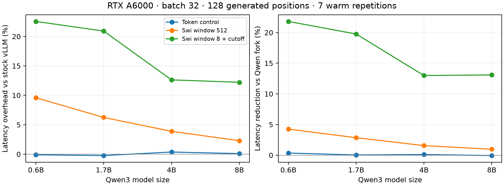
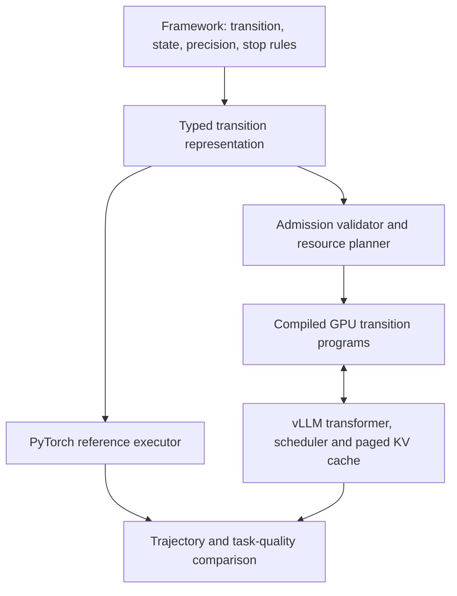

# Programmable decoding: complete policies and the second optimization round

This round adds a complete bounded SwiReasoning state machine, measures the
remaining execution overhead, and tests numerical and approximate alternatives.
The generic tensor language remains available for hidden feedback and custom
projections. A combination of optimizations is useful, but enabling every
experimental backend is neither valid nor faster.

The implementation exposes three explicit profiles in `vllm.v1.latent`:

- `DEFAULT_OPTIMIZATIONS`: the previous conservative generic-program profile.
- `COMBINED_OPTIMIZATIONS`: shared-consumer gating, asynchronous metadata,
  captured eligible greedy sampling/LM head, fused Swi state, and parameterized
  graph reuse, in addition to the generic profile.
- `REFERENCE_SHAPE_OPTIMIZATIONS`: the combined profile plus exact active-row
  expectation shapes. This can improve agreement with the reference Swi
  implementation at additional admission and execution cost; it is not a
  bitwise-equivalence guarantee.

None silently enables BF16 expectations, top-k truncation, adaptive truncation,
or low-rank feedback. Those are explicit algorithm changes. The original
generic default is retained because the new combination does not consistently
accelerate already-warm generic programs.

## Measured latency

Median seconds for 128 generated positions at batch 32 on the same RTX A6000.
The fork uses the combined FP32 profile; lower is better. The two percentages
compare against the pinned QwenReasoning vLLM implementation.

| Qwen3 | Stock token | Fork token | Qwen Swi 512 | Fork Swi 512 | Reduction | Qwen Swi 8 | Fork Swi 8 | Reduction |
| --- | --- | --- | --- | --- | --- | --- | --- | --- |
| 0.6B | 0.677 | 0.676 | 0.775 | 0.742 | 4.3% | 1.061 | 0.829 | 21.8% |
| 1.7B | 1.131 | 1.128 | 1.237 | 1.201 | 2.9% | 1.704 | 1.367 | 19.8% |
| 4B | 2.120 | 2.128 | 2.238 | 2.203 | 1.6% | 2.745 | 2.388 | 13.0% |
| 8B | 3.665 | 3.669 | 3.786 | 3.749 | 1.0% | 4.733 | 4.113 | 13.1% |

Token-only overhead stays within 0.4% at batch 32. The long-window Swi policy
adds 9.6%, 6.2%, 3.9% and 2.3% over stock token decoding as model size grows;
the frequent-switching policy adds 22.6%, 20.9%, 12.6% and 12.2%. These are extra
latent computations, so reaching token-only latency is not free. Smaller models
are more sensitive to fixed transition and vocabulary-processing overhead.
At batch 1, frequent-switching reductions versus Qwen are 14.0%, 8.0%, 5.4% and
9.0%; benefits depend on workload and batching, not just parameter count.

The exact-row profile reduces the frequent-switching advantage and sometimes
makes the long-window path slower than Qwen. All batches, repeat intervals,
trace matches and exact-row results are in [TABLES.md](TABLES.md). Numerical
trajectory differences qualify every cross-engine latency claim below.

## Usable components in the fork

| Component | Entry point | Current use |
| --- | --- | --- |
| Bounded transition language and validation | [program.py](../../vllm/v1/latent/program.py), [validation.py](../../vllm/v1/latent/validation.py) | Logit/hidden-state transforms, projections, masks and bounded per-request state. |
| SwiReasoning controller | [swireasoning.py](../../vllm/v1/latent/swireasoning.py) | Entropy switching, anchor blending, forced queues and termination state. |
| GPU execution and replay | [runner.py](../../vllm/v1/latent/runner.py), [staging.py](../../vllm/v1/latent/staging.py) | Batch-compatible embedding feedback and latent state recovery after preemption. |
| Admission and metadata reuse | [parameters.py](../../vllm/v1/latent/parameters.py), [transfer.py](../../vllm/v1/latent/transfer.py) | Reuse structural programs with different constants and event-protected metadata buffers. |
| Public configuration and examples | [implementation guide](../../LATENT_DECODE.md) | Enable supported policies and explicitly choose optimization/precision tradeoffs. |

These are implemented research components. The supported surface is synchronous,
single-GPU Qwen3/Llama text inference with the restrictions in the guide. Generic
programs are available now; a stable framework-neutral public API and a full
PyTorch reference backend are recommendations for the next stage.

## Protocol

We use the pinned Qwen3 0.6B, 1.7B, 4B and 8B checkpoints in
[models.json](../scaling/models.json), BF16 weights, RTX A6000 48 GB GPUs,
single-GPU synchronous V1 decoding, no prefix cache, and no speculative decoding.
The container is
`vllm/vllm-openai@sha256:c1c9f6fd5c109ba7f0546a59f5b2f15fb87f64c77782e90a27b648b42a8e67c3`.
The current fork and stock control use vLLM 0.31.0, PyTorch 2.13 and CUDA 13.
Hardware identities are in [hardware](hardware); package inventories are in
`requirements-vllm031.txt`, `requirements-qwen.txt`, and `requirements-1cat.txt`.

Fixed-work latency uses 128 generated positions, batches 1/8/32, two warmups,
and seven timed generations per final configuration. Screening ablations use
five repetitions. Timings include tokenization, admission, prefill and decode;
loading, compilation and first program capture are reported separately. They
are end-to-end generation times, not isolated inter-token latency or a serving
SLO. EOS is ignored only in these fixed-work runs.

The final paired comparison runs the Qwen fork, both new profiles, and stock
sequentially on the **same physical GPU**. Software versions still differ:
these are practical engine comparisons, not a claim that all cross-engine
differences come from the transition layer. The generic before/after comparison
uses the previous release `4ded5b28a882fb4c8d7930988ae55e7d6b105949` and stock
controls bracketing the experiment on the main GPU. Small differences near
control drift are inconclusive. Bootstrap intervals describe repeat variability
within a session, not uncertainty across days, devices, or prompt distributions.

The [generated tables](TABLES.md) contain every final comparison and quality
score. [summarize_round2.py](../../benchmarks/latent/summarize_round2.py) rebuilds
the tables, CSV files and scaling figure from raw measurements.

Ordinary high-throughput execution is not bitwise deterministic here: some
repeated greedy calls differ even in stock controls. `verification.json`
enumerates those groups. The fixed output length is controlled, but the exact
latent trajectory and number of active transitions can vary. Trace-agreement
tables compare the first recorded repetition rather than selecting the best
matching repetition. This is a further reason not to interpret small latency
or accuracy differences as a universal engine advantage.

## What changed and what the ablations establish

| Change | Evidence and interpretation |
| --- | --- |
| Complete SwiReasoning | Eight device state registers implement entropy trends, dwell time, sampled end-think locking, anchor blending, forced queues and termination budgets. The reference CPU state holder is driven with identical inputs by `swi_oracle.py`; this is independent of transformer numerical drift. |
| Shared-consumer gating | A union of all live consumers guards a shared expectation. The 0.6B two-threshold workload improves from 0.7620 to 0.7381 s at batch 32 in the initial screen; a fixed mixed-policy workload does not show the same benefit. |
| Pinned metadata ring | Event-protected host buffers replace blocking copies. The combined profile eliminates 257 `cudaStreamSynchronize` calls in the profiled generation, while normal sampled-ID event synchronization remains. This does not remove host scheduling or all CPU/GPU transfers. |
| Captured sampling/head | Eligible greedy, single-policy batches compute the head and sampler inside the transition graph. Stochastic sampling and incompatible batches retain the standard sampler. |
| Fused state | `torch.compile` fuses the internal, statically known Swi state machine before capture. No user callback is introduced into the decode loop. |
| Parameterized graphs | Numeric constants become per-request device parameters. In 28 turnover rounds, median cold generation falls from 133.8 ms to 90.7 ms; preloaded catalog admission is 89.7 ms. Warm medians are 88.5/90.6/89.7 ms respectively. Graph reuse primarily removes admission stalls, not steady-state transformer time. |
| Catalog and workspace | Operator catalog programs materialize before KV profiling. Dynamic admission can reserve `workspace_bytes`; this is headroom, not an enforced proof that every possible future program fits. The registry is bounded and inactive structural programs can be evicted. |
| Power-of-two compaction | Slower in the tested embedding-only microbenchmarks. On 8B, batch-32 FP32 dense expectation is about 3.59 ms versus 3.66–3.73 ms compacted, across 1–32 active rows. Sorting and branching do not avoid reading the large embedding table. Keep experimental. |
| Exact row compaction | Captures every possible row count to reduce reference GEMM-shape drift. This is a numerical tradeoff rather than a universally faster kernel. Padded rows are excluded from the active-consumer count. |

On the 0.6B batch-32 screen, the combined profile reduces Swi window-512 latency
from 0.7983 to 0.7715 s (3.4%) and window-8 latency from 0.9070 to 0.8716 s (3.9%).
On 8B the corresponding changes are 3.8825 to 3.8570 s (0.7%) and 4.2501 to
4.2380 s (0.3%). Individual effects are not additive; the 8B gains are small.
The fixed-policy generic combination has small regressions in some cases,
which is why it does not replace the generic default.

## Profiling

The matched 0.6B, batch-32, window-8 traces are retained in `profile-core` and
`profile-combo`. [profile-summary.json](profile-summary.json) is regenerated by
[summarize_profile.py](../../benchmarks/latent/summarize_profile.py).

| Recorded work | Core | Combined |
| --- | --- | --- |
| GPU kernel executions | 72,354 | 59,196 |
| Sum of GPU kernel durations | 682.7 ms | 653.2 ms |
| `cudaStreamSynchronize` calls | 257 | 0 |
| `cudaEventSynchronize` calls | 129 | 129 |
| `cudaGraphLaunch` calls | 285 | 285 |

These are instrumented event totals, not uninstrumented latency. Durations can
overlap and CPU events can nest. The combination reduces launch and state work,
but transformer execution, normal output synchronization and scheduler metadata
remain. The copy count actually increases when event-protected asynchronous
staging is used; fewer blocking calls does not mean zero communication.

## Numerical correctness and answer quality

The earlier 1.7B discrepancy is reproducible **without any decode program**.
Legacy embedding input versus native token input matches 23/32 traces with
ordinary compilation, 32/32 in eager mode, and 32/32 with compilation plus
explicit `+rms_norm`, all with batch-invariant mode enabled. One observed first
divergence is a near-tied greedy choice at position 84. This isolates the
compiled normalization/input path; it is not evidence of a KV ledger bug.
See `drift-*.json` and `round2_drift.py`. This diagnostic configuration is
available without silently changing ordinary engine defaults.

Matching a mathematical expectation does not imply matching BF16 trajectories.
The reference compacts active rows before its FP32 GEMM; a padded matrix changes
the GEMM shape and rounding. On 0.6B sampled GSM8K, the padded window-512 path
scores 81/128 against the reference's 92/128. Using exact active-row shapes
restores 92/128 and matches 127/128 complete traces. For window 32, exact shapes
restore the reference's 87/128 and match 123/128 complete traces. The remaining
differences begin at positions 1,636–2,019 in length-limited answers. This does
not establish universal bitwise equivalence, especially on other models and
software versions.

Exact row shapes alone are insufficient when the LM head is captured in a
different execution context. In a further 0.6B greedy check, removing
`capture_head`, enabling `tail_sample`, and retaining `exact_compact` matches
the Qwen reference's full traces for all six window-512/window-8 and batch-1/8/32
configurations. At batch 32 this takes 0.803/0.893 s, versus 0.742/0.829 s for
the fast profile. This is evidence for an explicit fidelity/performance choice,
not a claim of equivalent behavior for untested models or workloads. The main
four-model exact-shape timings retain head capture; see `exact-nohead0.jsonl`
for this separate diagnostic.

Quality uses 128 seeded test questions from
[OpenAI's GSM8K](https://github.com/openai/grade-school-math/tree/3101c7d5072418e28b9008a6636bde82a006892c),
with questions, gold answers, indices and source hash retained in
[gsm8k-128.json](gsm8k-128.json); its license is [GSM8K-LICENSE](GSM8K-LICENSE).
Primary runs use temperature 0.6, top-p .95, top-k 20, seed 20261006, a 2,048
position budget and natural EOS. The chat template enables thinking. A final
numeric answer after `</think>` must match the gold integer; unfinished thinking
fails. Full generated tokens, text and termination reasons are retained.

The initial greedy 1,024-position experiment is retained as a budget stress
test. It is unsuitable for ranking reasoning ability: the 8B token control
exhausts its length budget on 115/128 questions. Window-8 with a two-switch
cutoff is likewise an aggressive stress policy, not an accuracy recommendation.

One small test subset and one sampling seed cannot establish quality equivalence
or a general reasoning improvement. There are cross-engine trace differences
even in token controls, particularly on larger models. Approximation quality
is therefore compared against the same engine's dense window-32 policy, with
paired-question intervals in the generated tables. End-to-end quality-run
seconds include different generated lengths and must not be read as fixed-work
speedups.

## Quality results at a glance

Correct answers out of 128, one seed and a 2,048-position budget. Each triple is
**token / Swi window 512 / dense Swi window 32**. This is a budget-constrained
validation set, not a model ranking or a proof of quality equivalence.

| Model | Qwen reference | Fork combined | Fork exact rows (512 / 32) |
| --- | --- | --- | --- |
| 0.6B | 92 / 92 / 87 | 92 / 81 / 90 | 92 / 87 |
| 1.7B | 79 / 79 / 80 | 79 / 89 / 78 | 89 / 80 |
| 4B | 81 / 81 / 79 | 83 / 84 / 80 | 86 / 79 |
| 8B | 75 / 78 / 82 | 81 / 78 / 82 | 78 / 83 |

The complete four-model quality screen used the archived v3 implementation;
exact-row follow-ups use v5. Final v6 changes gate approximate mixtures during
inactive phases. Its 0.6B quality follow-up and the identical-input and strict
trajectory audits are retained separately. Do not conflate these source
versions or treat positive score differences as established reasoning gains.

## Approximation decisions

BF16 changes the expectation operands; top-k keeps 64 entries; adaptive keeps
the smallest prefix of those entries reaching mass .99, if that mass fits under
the cap. All retain exact full-vocabulary entropy for switching. The adaptive
cap does not guarantee retaining .99 probability mass. Rank-128 factors are a
seeded randomized SVD fit to the actual embedding table, not a trained reasoning
head. Their relative reconstruction errors are .843, .907, .907 and .937 across
the four model sizes. The 0.6B low-rank answer score collapses to 1/128.

The initial approximation implementation evaluated its mixture during token-only
phases. The final implementation uses a captured GPU conditional to skip that
work when there are no live consumers. `approx-timing*` retains the initial
measurements; `approx-gated*` reports the final path. The dedicated replay test
alternates inactive and active masks for all three approximate backends. An
additional real-table audit supplies identical quantized logits at batches
1/3/8/32: all 400 conditional/unconditional top-k and adaptive cases produce
bit-identical outputs. Full-generation trace agreement is checked separately;
arithmetic agreement given identical inputs is not a promise that model inputs
remain identical under normal batching.

The isolated adaptive audit initially produced different full trajectories under
ordinary execution despite bit-identical mixture arithmetic on identical inputs.
With `VLLM_BATCH_INVARIANT=1` and explicit `+rms_norm`, the before/after gating
implementations produce **128/128 identical full trajectories**, each scoring
87/128. See `adaptive-strict-base.jsonl` and `adaptive-strict-gated.jsonl`.
This validates that comparison under those settings; it does not promise
invariance for all approximate policies and model sizes.

Low-rank substitution is rejected for the recommended profile. BF16, top-k and
adaptive remain opt-in experiments: a latency benefit alone does not justify
silently changing a latent trajectory. A trained projection or distillation
objective would be a different experiment from truncating an existing table.

## Which system to build on

Continue with **vLLM as the execution backend, a framework-neutral transition
compiler, and a simple PyTorch reference executor**. The measured benefit is
useful inference infrastructure: efficient batched execution, bounded device
state, and fewer method-specific engine modifications. We have not established
a general improvement in reasoning accuracy or universal framework coverage.

The proposed architecture separates the framework definition from engine details:

The fork implements the bounded language, device execution, scheduling
integration, replay state and a complete Swi controller. The standalone
framework-neutral API and full PyTorch transformer reference backend in this
diagram are **recommended next architecture work**, not delivered components.
Our current independent reference checks cover tensor programs and the Swi
controller, with external inference forks providing end-to-end comparisons.

| Need | Recommended system | Reason and boundary |
| --- | --- | --- |
| Batched synchronous methods that emit one next embedding per transformer position | This vLLM backend, behind a stable transition interface | Directly supported by the measured scheduling and replay work. Use the generic conservative profile or explicitly selected Swi profile. |
| Inventing a method with unrestricted tensor operations, a new recurrent architecture, or changes inside attention | PyTorch reference implementation first | Define and test semantics before choosing a bounded lowering. A transition layer alone cannot express every architectural change. |
| Reproducing a particular published method | Its pinned implementation as the reference | Preserve its precision, sampling, stop conditions and trained checkpoints before attributing quality differences to optimization. |
| Another serving backend or an existing SGLang deployment | A later SGLang adapter to the same representation | Plausible portability target, but not benchmarked here and not a demonstrated improvement over the measured vLLM path. |

There are relevant alternatives rather than an empty ecosystem:
[QwenReasoning](https://github.com/zhaoc5/QwenReasoning) implements soft thinking
inside vLLM; [Soft-Thinking](https://github.com/UCSB-AI/Soft-Thinking) distributes
a modified SGLang package; and
[fast-subconscious](https://github.com/dibbla/fast-subconscious) describes a
mini-SGLang fork for latent chains and looped transformers. These establish
useful implementation precedents. They do not establish a speed ranking against
our fork: only the pinned Qwen and 1Cat vLLM implementations were timed in this
round. The Soft-Thinking authors also report reproduction sensitivity to
precision; that is consistent with a need for explicit numerical contracts,
not proof of the cause of any discrepancy in our experiments.

The next interface should declare the exact hidden-state tap, whether logits
are before or after temperature, embedding and accumulator dtypes, RNG
consumption, output visibility, EOS behavior, state bounds and replay identity.
A supported step emits one vector and a bounded state update. Variable-length
internal loops, branching search that creates new sequences, altered attention,
and external tool calls need additional scheduling contracts. Merely being
synchronous does not make every framework fit the current transition model.

For runtime, prioritize work in this order:

1. Make numerical behavior selectable and testable. Compare identical-input
   transitions before full trajectories; preserve reference row shapes and
   normalization where required. Kernel fusion is not automatically semantics
   preserving in floating point.
2. Keep admission predictable with structural templates, preloaded constants,
   catalog capture and a measured workspace plan. Parameter reuse has a clear
   cold-admission benefit; warm execution has much less room to improve.
3. Optimize the remaining full-vocabulary passes and embedding-table traffic.
   A fused dense expectation/entropy kernel is a candidate, but its reduction
   order needs explicit validation. Our compaction experiment did not improve
   that bandwidth cost, and blind rank reduction damaged quality.
4. Reduce scheduling and metadata overhead without changing the synchronous
   request contract. The profile still contains sampled-ID event waits and
   host transfers; eliminating stream waits did not eliminate all overhead.
5. Establish a narrow maintained worker interface, then add another backend or
   distributed execution when a concrete framework requires it. Retain the
   transformer scheduler and paged cache rather than building another serving
   engine around every new reasoning policy.

The success criterion should be **more frameworks with verified semantics and
competitive throughput**, followed by quality-adjusted time to a correct
answer. Fixed-position latency is useful calibration, but a faster trajectory
that solves fewer tasks is not an overall improvement.

## Reproduction and scope

The retained corpus contains **506 timing groups, 3,206 timed generations,
65 quality runs and 8,320 generated answers**, including screens and numerical
diagnostics. These counts do not mean independent benchmark datasets. Coverage
verification checks 33 required result files; the GPU suite passes 37 tests,
the independent controller oracle checks 16,384 transitions, and the real-table
conditional arithmetic audit checks 400 cases.

Raw JSONL records are gzip-compressed without changing their contents. The
summarizer and verifier accept both `.jsonl` and `.jsonl.gz`; logical filenames
in the text and launch scripts refer to those records. Runtime logs are retained
in `run-logs.tar.gz`. Source snapshots, package inventories, GPU identities and
SHA-256 manifests accompany the results.

The scripts in [benchmarks/latent](../../benchmarks/latent) generate fixed-work
timings, admission tests, quality runs, compaction microbenchmarks, SVD factors,
state-machine oracle checks, and numerical diagnostics. `launch-*.sh` records
the actual machine-specific sequencing. They require the pinned container,
matching comparator wheels/overlays, cached checkpoint revisions and the mounted
workspace paths shown in the scripts; they are not a portable cloud installer.
Source archives preserve successive measured implementations, including the
initial screens, padding correction and final approximation gating. Factor
hashes permit checking regenerated external factor files without committing
large model-derived tensors.

The mixed-policy 8B replay check gives identical outputs for all 12 requests with
11,000 versus 32 KV blocks. The constrained run performs four preemptions,
while the ample-cache run performs none. Unequal lifetimes, chunked prefill,
Swi state and generic policies are exercised together.

The implementation remains bounded, synchronous, single-GPU research software.
It does not add tensor parallelism, asynchronous execution, prefix-cache
identity for latent histories, multimodal support, arbitrary user callbacks,
or every cited framework's trained model. The existing
[comparator survey](../scaling/COMPARATORS.md) distinguishes native vLLM forks
from related systems and model-specific plugins. The fresh 1Cat comparison
still reflects its eager dense-Qwen3 feedback path, not its original hybrid-model
deployment target.
