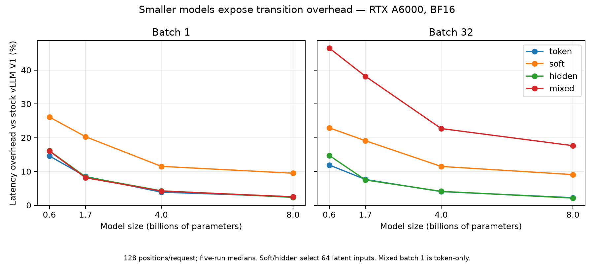

# Model-size scaling and existing-fork comparison

The programmable transition layer works on Qwen3 0.6B, 1.7B, 4B, and 8B, but
its relative overhead grows substantially as the transformer shrinks. The
principal minimization issues are fixed dispatch/data-movement cost,
vocabulary-sized buffers, and repeated work across heterogeneous programs.
Existing specialized implementations can be competitive or faster for their
own policies. Raw hidden-state feedback also exposes numerical sensitivity
that ordinary token-output checks can miss.

This follow-up benchmarks implementation commit `045a0a1` without changing its
engine code. It adds 168 timing groups and 840 measured generation runs:
four models, batches 1/8/32, five repetitions, and separate controls for each
engine. All primary runs use 128 generated positions, BF16, V1 runners,
synchronous scheduling, and RTX A6000 48 GB GPUs. Loading, initial compilation,
and warmup are excluded. These are end-to-end fixed-work timings, not isolated
inter-token latency, online arrival-load SLOs, or reasoning-quality scores.
Timed requests reuse already captured program identities. First-use program
materialization and workloads that continually introduce new programs are not
measured by these warm runs.

## Cost of shrinking the model

Batch 1, median wall-clock latency. Percentages are relative to stock vLLM
0.31.0 V1 for the same model and batch:

| Model | Stock V1 (s) | Token program | Hidden feedback | Dense soft feedback |
| --- | --- | --- | --- | --- |
| 0.6B | 0.4570 | +14.6% | +16.1% | +26.1% |
| 1.7B | 0.8875 | +8.5% | +8.4% | +20.3% |
| 4B | 1.8267 | +3.9% | +4.3% | +11.5% |
| 8B | 3.1553 | +2.5% | +2.3% | +9.5% |

The disabled extension changes latency by less than 0.7% in this sweep. An
enabled token program adds approximately 0.52–0.62 ms per generated position
at batch 1, after amortizing the complete request time over 128 positions.
That almost fixed cost is 14.6% of the 0.6B baseline but only 2.5% of 8B.
The embedding-input path itself accounts for part of the difference;
`embed_control` in the raw data separates it from program execution.



The four-program mix cycles token, soft, hidden, and entropy-gated requests.
It exposes additional per-program grouping, indexing, and graph-launch costs:

| Model | Batch 32 stock (s) | Four-program mix (s) | Overhead |
| --- | --- | --- | --- |
| 0.6B | 0.6760 | 0.9906 | +46.5% |
| 1.7B | 1.1344 | 1.5674 | +38.2% |
| 4B | 2.1376 | 2.6228 | +22.7% |
| 8B | 3.6904 | 4.3411 | +17.6% |

Batch 1 of the mixed workload is token-only, so it is not evidence of
heterogeneous execution. At larger batches, grouping keeps the transformer
batched but executes the transition programs separately. Multiple expectation
operations can reread the embedding table. The full batch-8 and batch-32
results, plus absolute added time, are in [TABLES.md](TABLES.md) and
[summary.csv](summary.csv).

## Existing vLLM implementations

The search found two directly testable native vLLM implementations:
[QwenReasoning's fork](https://github.com/zhaoc5/vllm/tree/31418258c7d8896c2f9259931cccff938d69cb0c)
and the
[SwiReasoning/1Cat fork](https://github.com/dg1kjd/vllm-v100-sxm2-qwen3.5-397b/tree/3c21680950c8842b30d48f0a5757d3130101095f).
The [survey and protocol](COMPARATORS.md) identify additional model-specific
vLLM integrations and related SGLang work, and explain their inclusion or
exclusion. Each measured fork uses its own matching native libraries and an
unmodified Python source overlay, with base-wheel and fork-disabled controls.

Batch 1 latency in seconds for 128 positions:

| Model | Our dense soft | Qwen soft top-10 | Qwen SwiReasoning | 1Cat SwiReasoning |
| --- | --- | --- | --- | --- |
| 0.6B | 0.5764 | 0.5992 | 0.5093 | 1.9868 |
| 1.7B | 1.0675 | 1.0411 | 0.9546 | 2.4170 |
| 4B | 2.0370 | 1.9654 | 1.9061 | 3.1640 |
| 8B | 3.4546 | 3.2964 | 3.2294 | 4.4842 |

These columns do **not** execute an identical algorithm. Our dense-soft
preset selects 64 latent inputs followed by 64 token inputs, but computes its
mixture on every position. Qwen Soft Thinking uses a normalized top-10 mixture
and its native thinking-end policy. The two SwiReasoning implementations use
closely aligned entropy-switch settings, full-vocabulary FP32 arithmetic,
and their own state machines. Their latent-position counts are not held equal
to our preset. None of these measurements establishes equal reasoning quality.

QwenReasoning's SwiReasoning overhead is 15–18% at 0.6B and 2.5–3.5% at 8B
against its own disabled control. Its top-10 Soft Thinking overhead is
32–36% at 0.6B and 4.7–6.1% at 8B. The general programmable interface is
therefore not automatically faster than a specialized policy implementation.

The older SwiReasoning/1Cat fork adds 292–344% at 0.6B and 42–52% at 8B.
Its default token-input configuration crashed upon the first embedding
feedback; enabling prompt embeddings from initialization fixed that input
signature problem without editing its code. On these dense Qwen3 models it
still dispatches injection steps eagerly, builds the FP32 mixture in chunks,
and performs host-side state decisions. These are plausible sources of the
additional cost, not an isolated causal attribution from this experiment.
Its intended TP8 V100/Qwen3.5 hybrid-model deployment has a different graph
path and is not characterized by these A6000 measurements.

See [COMPARATOR_TABLES.md](COMPARATOR_TABLES.md) for every batch and the
corresponding base/disabled controls. Software stacks differ: our fork uses
vLLM 0.31.0 / Torch 2.13 / CUDA 13; QwenReasoning uses its pinned upstream
0.27 development wheel / Torch 2.13 / CUDA 13; the older fork uses
1Cat-vLLM 1.2.1 / Torch 2.10 / CUDA 12.8. Cross-fork token traces are not
universally identical, even under the aligned SwiReasoning settings.

## Stock public-API latent feedback

This separate comparison uses eight positions, batch 1, four soft transitions,
three repetitions, and prefix caching enabled for the stock adapter. The
adapter resubmits accumulated embeddings and retrieves full-vocabulary
logprobs; the programmable engine retains a live request and cached state.
All four short soft traces match the independent Transformers reference.

| Model | Stock public API (s) | Programmable fork (s) | Ratio |
| --- | --- | --- | --- |
| 0.6B | 1.6007 | 0.0466 | 34.3× |
| 1.7B | 1.2972 | 0.0743 | 17.5× |
| 4B | 1.4586 | 0.1306 | 11.2× |
| 8B | 1.7900 | 0.2204 | 8.1× |

This is a speedup over the specified public-API adapter, not over native
SwiReasoning or every possible private modification to stock vLLM. Adapter
latency is dominated by host/API work and is not monotonic in model size.
It also varies across runs: the fresh 8B adapter measured 1.79 s, versus
about 1.41 s in the earlier calibration, while the fork remained about
0.22 s. The large gap is clear; the exact ratio should not be treated as a
hardware-independent constant.

## Memory and transition-only execution

Every checkpoint has a 151,936-row vocabulary. The embedding table shrinks
with model width, but logits buffers do not. History below assumes 64 reserved
request slots and 128 positions, as in the primary sweep.

| Model | Width | BF16 embedding table (MiB) | History (MiB) | Token / soft graph active allocation (MiB) | Soft graph, batch 1 (ms) |
| --- | --- | --- | --- | --- | --- |
| 0.6B | 1024 | 296.8 | 16 | 37.0 / 45.1 | 0.517 |
| 1.7B | 2048 | 593.5 | 32 | 37.3 / 45.7 | 0.956 |
| 4B | 2560 | 741.9 | 40 | 37.5 / 45.9 | 1.172 |
| 8B | 4096 | 1187.0 | 64 | 38.0 / 46.4 | 1.837 |

Graph allocation is the incremental **active PyTorch allocation** observed
while constructing captures for batches 1/2/4/8/16/32, excluding the embedding
table allocated beforehand. It is not total reserved allocator memory, total
VRAM usage, or a KV-cache capacity measurement; first-use backend workspace
can contribute. The token graph alone retains about 37–38 MiB, largely from
logits inputs it does not actually use. Sixteen distinct programs can thus
retain roughly 0.6 GiB of such buffers before their other workspace costs.
No tested model ran out of memory, but this implementation does not yet reserve
all graph workspace in advance of KV-cache sizing.

The CUDA-event kernel measurements exclude input staging, indexing, scheduler
work, and the transformer. Token graph execution is only about 0.02 ms at
batch 1, much smaller than the approximately 0.5–0.6 ms added end-to-end cost.
Dense soft execution grows with embedding-table width. Masking a soft output
off does not currently skip its matrix multiplication.

## Correctness and numerical reproducibility

- Stock versus disabled fork: all 12 model/batch combinations match exactly.
- Enabled token program versus embedding-input control: all nine smaller-model
  combinations match. The fresh 8B run differs in all three batch-level traces;
  the first batch-1 difference is at zero-based position 87. Earlier 8B runs
  matched, so exact preservation cannot be assumed under the default kernels.
  With `VLLM_BATCH_INVARIANT=1`, all three 8B comparisons match exactly.
  Those diagnostic timings are separate from the primary performance tables.
  Results are retained in `invariant-control.jsonl` and `verification.json`.
- Independent eight-position token and soft traces match on all four models.
  The stock soft-replay adapter also matches all four.
- Free-running raw-hidden feedback matches on 0.6B and 8B, but diverges on
  1.7B and 4B. When Transformers consumes the exact recorded vLLM embedding
  trajectory, both disputed continuations match the fork. Corresponding hidden
  vectors have cosine similarity at least 0.99966, with relative L2 differences
  of approximately 1.4–2.8%. Feeding independently computed BF16 vectors back
  repeatedly can amplify those differences into different greedy tokens.
  This supports numerical sensitivity rather than a misplaced feedback vector;
  it is not a guarantee of long-horizon equivalence or reasoning quality.
- External base-wheel versus fork-disabled final traces match 10/12 groups
  for QwenReasoning and 8/12 for SwiReasoning/1Cat. Some repeated runs also
  vary within an engine. Those discrepancies are retained explicitly; no
  universal bitwise-equivalence claim is made for these external stacks.

The original semantic and preemption tests remain documented in the
[8B report](../latent/REPORT.md). This follow-up changes benchmark tooling and
reports, not the transition engine. The failed default SwiReasoning attempt,
raw reference comparisons, recorded hidden trajectories, and diagnostic
results are included for review.

## Priorities suggested by the measurements

1. **Prune unused inputs.** Token and hidden programs should not gather, clone,
   retain, or stage full-vocabulary logits unless their predicates need them.
   Hidden-only phases could also omit the LM head when the emission contract
   permits it.
2. **Skip inactive expensive work.** Selecting token feedback should avoid
   evaluating the soft mixture, rather than merely discarding its result.
3. **Share work across programs.** Combine common softmax/expectation operations
   and reduce per-program host indexing, transfers, and separate graph launches.
   Mixed small-model batches are the clearest stress case.
4. **Budget graph memory before KV sizing.** Include capture buffers, temporary
   storage, constants, and replay history in admission accounting. Reduce
   duplicate capture inputs across compatible programs.
5. **Make numerical behavior part of the framework contract.** Support explicit
   precision choices and stable projections/normalization where appropriate.
   Validate task accuracy before interpreting a shorter or different latent
   trajectory as an improvement.

The results justify a reusable transition interface, but not a claim that
embedding feedback itself is new, that this prototype reproduces full
SwiReasoning, or that it supports every synchronous framework. Quantization,
tensor parallelism, V2 integration, dynamic arrival-load tests, and reasoning
accuracy remain outside this calibration.

## Reproduction and artifacts

[models.json](models.json) pins checkpoints; [provenance.json](provenance.json)
pins engine sources, container, and GPUs. The three `*-requirements.txt` files
record installed package versions; the native inventory's local wheel path
refers to the pinned container. The comparison uses separate physical A6000s,
without locked GPU clocks. Small sub-percent changes should be treated as
noise, not architectural wins.

The GPU entry points are `benchmarks/latent/scaling_job.sh`, `qwen_job.sh`,
`swir_job.sh`, and `scaling_verify_job.sh`, using the pinned image and resources
in `benchmarks/latent/job.yaml`. External checkouts belong in the sibling
`latent-comparators/qwen-vllm` and `latent-comparators/swir-vllm` directories at
the commits in the provenance file. The cluster wrappers currently use
`/home/edonson/vllm-latent`; adjust that path for another environment.
Run each engine sequentially on its allocated GPU and use fresh output files
for a new experiment. The external suite can resume completed model/mode
sets. `hidden_audit.py` provides the untimed recorded-embedding diagnostic;
`invariant_control_job.sh` provides the separate reproducibility check.

To validate and regenerate the tables and figures from the included data:

```bash
.venv/bin/python benchmarks/latent/verify_scaling_results.py
.venv/bin/python benchmarks/latent/summarize_scaling.py
.venv/bin/pre-commit run
```

Raw measurements are `native.jsonl`, `qwen.jsonl`, `swir.jsonl`, `short-*.jsonl`,
and `replay-*.json`. Timing ranges are in the CSV files. This report deliberately
retains mismatching traces and failed configurations alongside successful
results.
